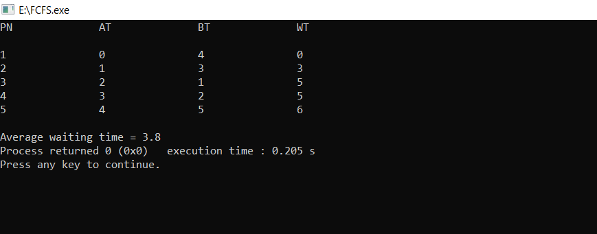

<h1>First Come First Serve</h1>
<h2>Description</h2>
<h4>This program calculates the waiting time for processes based on their arrival time and burst time. It iterates through each process, calculates the waiting time using the formula: \( \text{WT}[i] = (\text{AT}[i-1] + \text{BT}[i-1] + \text{WT}[i-1]) - \text{AT}[i] \), and then computes the average waiting time.</h4>
<h2>Input Details</h2>
<h4>The program takes the following inputs:</h4>
<ul>
<li><strong>Number of processes (N):</strong> 5</li>
<li><strong>Array for Arrival time (AT):</strong> { 0, 1, 2, 3, 4 }</li>
<li><strong>Array for Burst Time (BT):</strong> { 4, 3, 1, 2, 5 }</li>
</ul>
<h2>Output Example</h2>

Output displays the process number, arrival time, burst time, and waiting time for each process:

<table>
<tr>
<th>PN</th>
<th>AT</th>
<th>BT</th>
<th>WT</th>
</tr>
<tr>
<td>1</td>
<td>0</td>
<td>4</td>
<td>0</td>
</tr>
<tr>
<td>2</td>
<td>1</td>
<td>3</td>
<td>4</td>
</tr>
<tr>
<td>3</td>
<td>2</td>
<td>1</td>
<td>6</td>
</tr>
<tr>
<td>4</td>
<td>3</td>
<td>2</td>
<td>7</td>
</tr>
<tr>
<td>5</td>
<td>4</td>
<td>5</td>
<td>9</td>
</tr>
</table>
<h4><strong>Average waiting time = 5.2</strong></h4>
 
